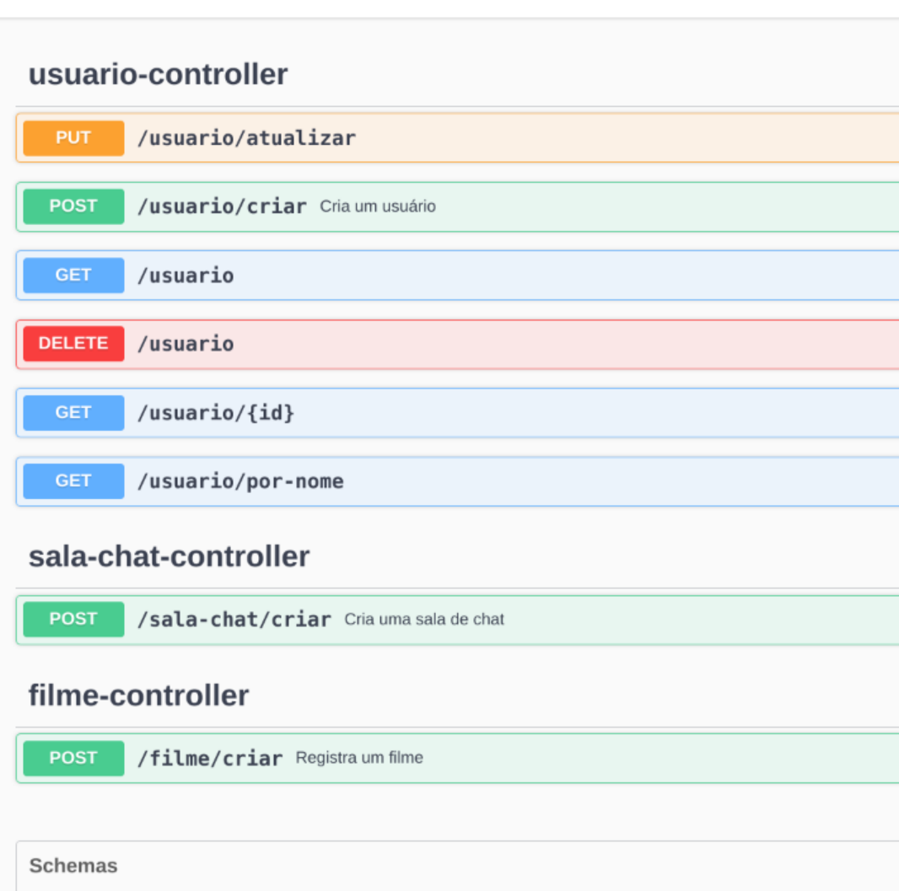
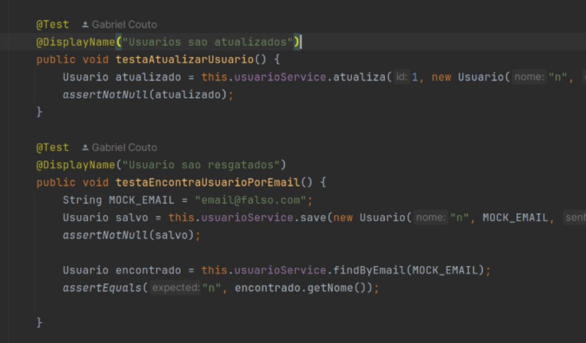

# Twowatch

Documentação para o projeto que consiste em uma Rede social de Filmes.
Este documento fornece uma visão geral dos diversos pontos finais e funcionalidades fornecidos pelo servidor backend.

## Visão Geral

O backend serve como o componente central de nossa aplicação, gerenciando a autenticação do usuário, armazenamento de filmes, funcionalidade de chat e salas privadas. Abaixo estão as principais entidades e funcionalidades fornecidas pelo backend:

- **Usuário**: Representa um usuário registrado da aplicação. 
- **Sala de Chat**: Um espaço virtual onde os usuários podem discutir sobre filmes.
- **Filmes**: Informações sobre os filmes adicionados à biblioteca.

<br/>

- **Mensagens de Chat**: Mensagens trocadas dentro de uma sala de chat. [Sendo implementado]
- **Sala Privada**: Salas de chat privadas entre usuários específicos. [Futuro]


<br/>

- **Posts/Comentarios**: Usuarios podem criar posts publicos com comentarios.

## Endpoints da API
 
 
## Domínio

### Filme

```ts
{
    id: number;
    tmdb_id: string;
    original_title: string;
    title: string;
    backdrop_path: string;
    imdb_id: string;
    original_language: string;
    overview: string;
    popularity: number;
    poster_path: string;
    release_date: string;
    revenue: number;
    runtime: number;
    status: string;
    tagline: Filme;
}
```

### SalaChat

```ts
 {
  id: number;
  nome: string;
  filme: Filme;
  usuarios: Usuario[];
  }

```

### Usuário

```ts
 {
  id: number;
  nome: string;
  email: string;
  senha: string;
  salaChats: SalaChat[];
  }
```


### Exemplos de uso

###### Os exemplos de uso podem ser encontrados nos próprios testes, eis abaixo um exemplo

###### onde é possivel ver como utilizar o service de usuarios para atualizar um usuário existente
###### ou encontrar um usuario por email
